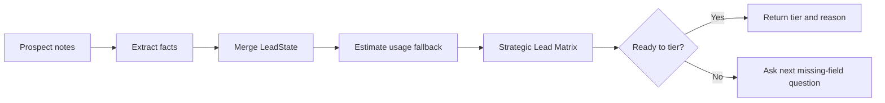

<div align="center">

# ABC Energy Lead Qualification Workspace

Internal lead qualification MVP for ABC Energy Solutions.

<a href="https://dirm02-onittest-abc-energy.netlify.app">Live Demo</a>
|
<a href="https://dirm02-onittest-abc-energy.netlify.app/api/v1/health">Backend Health</a>
|
<a href="docs/mvp-plan.md">MVP Plan</a>

<br />
<br />


<br />
<br />


</div>

## Overview

This repository contains a full-stack proof of concept for the ABC Energy Solutions hiring challenge. The product is an internal sales intake workspace: an ABC Energy team member pastes prospect notes from a call, CRM record, spreadsheet row, email, or research snippet, and the assistant turns those notes into a structured lead profile.

The MVP collects the required qualification variables, runs the Strategic Lead Matrix, and returns a deterministic tier recommendation. The LLM provider is configured for future extraction work, but the current tiering logic stays outside the model so it remains testable, explainable, and auditable.

## Live System

| Surface | URL |
|---|---|
| Frontend | https://dirm02-onittest-abc-energy.netlify.app |
| Health check | https://dirm02-onittest-abc-energy.netlify.app/api/v1/health |
| Lead endpoint | `POST https://dirm02-onittest-abc-energy.netlify.app/api/v1/lead/turn` |
| Netlify project | https://app.netlify.com/projects/dirm02-onittest-abc-energy |

Production shape:

- Netlify hosts the Next.js frontend.
- Netlify proxies `/api/v1/lead/*` to the Azure VM backend.
- Azure VM `Prod3` runs FastAPI and PostgreSQL with Docker Compose.
- The backend keeps provider keys in `/opt/onittest-abc-energy/backend/.env`.

## What We Built

- Internal ABC Energy branded lead qualification workspace.
- Guided chat UI with quick-start prompts for prospect notes, known usage, and facility-size estimation.
- FastAPI endpoint for one qualification turn: `POST /api/v1/lead/turn`.
- Explicit `LeadState` with `unknown`, `inferred`, and `confirmed` slot statuses.
- PocketFlow orchestration for extract, merge, estimate, classify, plan, and respond steps.
- Deterministic Python rule engine for the Strategic Lead Matrix.
- Square-footage fallback when annual MWh is unavailable.
- Netlify production deployment with Next.js runtime support.
- Azure VM backend deployment with Postgres kept internal.
- Focused pytest coverage for the matrix, fallback, and extraction edge cases.

## User Flow

1. Internal reviewer opens the workspace.
2. Reviewer pastes prospect notes or enters known account facts.
3. Backend extracts structured lead fields.
4. Missing fields remain visible in the lead summary panel.
5. PocketFlow runs the lead state through deterministic matrix rules.
6. The assistant returns the tier, reason, and updated state.
7. Future phases can persist the result into a saved-leads review page.



## Strategic Lead Matrix

| Rule | Tier |
|---|---|
| Industrial, usage greater than 500 MWh, contract expires in less than 6 months | Tier 1 |
| Industrial, usage 100-500 MWh, contract expires in less than 12 months, building age under 5 years | Tier 2 |
| Commercial, usage greater than 50 MWh, month-to-month contract | Tier 1 |
| Commercial, usage 20-50 MWh, fixed term, building age under 2 years | Tier 3 |
| Any segment with no current provider | Tier 1 |
| Complete but unmatched profile | Manual Review |

## Try These Scenarios

Paste each one into the live chat.

### Tier 2 industrial lead

```text
industrial facility, 250 MWh annually, provider in place, fixed term contract expires in 8 months, building age 3 years.
```

Expected: `Tier 2`

### Tier 1 commercial month-to-month lead

```text
commercial office building, 75 MWh annually, current provider in place, month-to-month contract, building age 12 years.
```

Expected: `Tier 1`

### Tier 1 no-provider override

```text
Prospect has no current electricity provider. Commercial warehouse, around 40 MWh annually, fixed term details unknown.
```

Expected: `Tier 1`

## Architecture

| Layer | Choice | Notes |
|---|---|---|
| Frontend | Next.js 15, React 19, TypeScript, Tailwind | Deployed on Netlify |
| Backend | FastAPI, Pydantic v2 | Deployed on Azure VM |
| Orchestration | PocketFlow | Small, explicit per-turn flow |
| Database | PostgreSQL | Running in Docker on the VM |
| LLM target | Google Gemini | API key configured, extraction integration is next |
| Deployment | Netlify + Azure VM | Netlify proxies lead API calls to backend |

The current MVP uses deterministic extraction and deterministic tiering. This was intentional for the hiring test: it reduces moving parts and makes the business matrix easy to validate. The next step is to add Gemini structured extraction as a fallback-enhanced extractor while keeping the matrix rules deterministic.

## API Contract

### Request

```http
POST /api/v1/lead/turn
Content-Type: application/json
```

```json
{
  "message": "CRM note: industrial plant, 650 MWh annually, provider in place, contract expires in 5 months.",
  "session_id": "optional-client-session-id",
  "state": null
}
```

### Response

```json
{
  "session_id": "...",
  "response": "Tier 1: Industrial usage is above 500 MWh and contract expires within 6 months...",
  "state": {
    "business_segment": { "value": "industrial", "status": "confirmed" },
    "annual_usage_mwh": { "value": 650, "status": "confirmed" },
    "final_tier": { "value": "Tier 1", "status": "confirmed" }
  },
  "missing_fields": [],
  "classification": {
    "tier": "Tier 1",
    "ready": true,
    "matched_rule": "industrial_high_usage_expiring_soon"
  },
  "trace": {
    "source": "pocketflow",
    "nodes": ["extract", "merge", "estimate_usage", "classify", "plan_next_question", "respond"]
  }
}
```

## Local Development

### Backend

```bash
cd backend
uv run --extra dev pytest tests/test_lead_qualification.py
uv run uvicorn app.main:app --reload
```

Backend defaults to:

```text
http://localhost:8000
```

### Frontend

```bash
cd frontend
npm install
npm run dev
```

Frontend defaults to:

```text
http://localhost:3000
```

For local frontend-to-backend wiring:

```bash
NEXT_PUBLIC_API_URL=http://localhost:8000
NEXT_PUBLIC_WS_URL=ws://localhost:8000
```

## Environment Variables

Provider keys belong on the backend only.

Production backend env file on the Azure VM:

```text
/opt/onittest-abc-energy/backend/.env
```

Important values:

```bash
GOOGLE_API_KEY=...
AI_MODEL=gemini-3.1-pro-preview
SECRET_KEY=...
API_KEY=...
CORS_ORIGINS=["https://dirm02-onittest-abc-energy.netlify.app","http://52.165.83.50:8000"]
```

Do not put `GOOGLE_API_KEY` in Netlify for this architecture. The frontend talks to the backend, and only the backend should call Gemini.

## Verification

Backend:

```bash
cd backend
python -m pytest -p no:cacheprovider tests/test_lead_qualification.py
python -m ruff check app/lead_qualification tests/test_lead_qualification.py
```

Frontend:

```bash
cd frontend
npm run type-check
npm run lint
npm run build
```

Current note: frontend lint and build pass with warnings inherited from the generated scaffold in unrelated dashboard/chat files.

## Deployment

### Frontend

Netlify reads `netlify.toml`.

```bash
npx netlify deploy --prod --build
```

The Next.js runtime plugin is enabled so App Router pages, middleware, and generated server functions work on Netlify.

### Backend

Azure VM backend deployment uses:

```bash
docker-compose.azure.yml
scripts/deploy-prod3-backend.sh
```

The VM-specific compose file exposes FastAPI on port `8000` and keeps PostgreSQL internal.

## Current Limitations

- The lead endpoint is unauthenticated for the MVP demo.
- Gemini is configured but not yet integrated into the lead extraction flow.
- Lead conversations are not yet persisted into Postgres.
- Admin/saved-leads review is planned but not part of the current MVP surface.
- Netlify currently proxies to the VM by IP. A proper domain and TLS for the backend would be cleaner for production.

## Next Steps

1. Add Gemini structured extraction behind the existing extractor interface.
2. Persist conversations and final lead profiles into PostgreSQL.
3. Add a saved-leads page for internal review.
4. Add lightweight staff authentication or Netlify password protection.
5. Add tracing with Langfuse or Phoenix for extraction and model calls.
6. Add an evaluation set for the Strategic Lead Matrix scenarios.

## Project Status

The MVP is deployed and usable end to end. The live system can classify the core matrix scenarios, route lead API calls through Netlify to Azure, and display a clear internal qualification workflow for ABC Energy Solutions.
