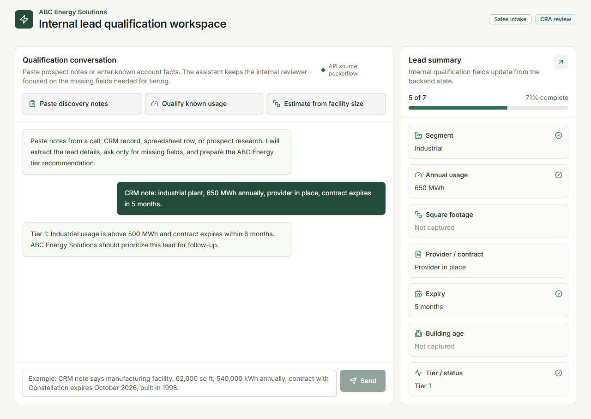
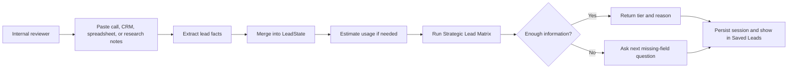

<div align="center">

# ABC Energy Lead Qualification Workspace

Proof of concept for the ABC Energy Solutions hiring challenge.

<a href="https://dirm02-onittest-abc-energy.netlify.app">Live Demo</a>
|
<a href="https://dirm02-onittest-abc-energy.netlify.app/api/v1/health">Backend Health</a>
|
<a href="docs/mvp-plan.md">MVP Plan</a>

<br />
<br />


<br />
<br />



</div>

## Executive Summary

This project solves the hiring test as an internal proof of concept, not as a fully commercialized SaaS product. The user is an ABC Energy Solutions internal reviewer, CRA team member, sales operator, or business development teammate who already has prospect information from calls, CRM records, spreadsheets, emails, or research notes.

The tool lets that internal reviewer paste messy prospect notes into a guided chat. The backend extracts lead facts, maintains a structured lead state, asks for missing qualification fields, applies the Strategic Lead Matrix, and returns an explainable tier recommendation.

The key engineering decision was to keep the final qualification rules deterministic. Gemini can help with extraction, but it does not decide the tier. That makes the output testable, auditable, and safer for a hiring challenge where the business matrix matters more than open-ended chat.

## What We Believe The Test Asked For

The prompt was intentionally vague, so we made one product assumption explicit:

**This is an internal lead qualification assistant for ABC Energy Solutions, not a customer-facing chatbot.**

That means the workflow is:

1. An internal reviewer opens the workspace.
2. The reviewer pastes information they already have about a potential client.
3. The assistant extracts the known facts.
4. The assistant shows which fields are captured and which are missing.
5. The backend applies deterministic tier rules.
6. If enough information exists, the assistant returns the tier and reason.
7. If information is missing, the assistant asks the next useful question.
8. The result is saved for internal review.

We intentionally did not build a public onboarding funnel where external clients qualify themselves. That would add privacy, consent, abuse prevention, authentication, and UX questions that are outside a focused PoC.

## Live System

| Surface | URL |
|---|---|
| Frontend | https://dirm02-onittest-abc-energy.netlify.app |
| Health check | https://dirm02-onittest-abc-energy.netlify.app/api/v1/health |
| Lead turn endpoint | `POST https://dirm02-onittest-abc-energy.netlify.app/api/v1/lead/turn` |
| Saved sessions endpoint | `GET https://dirm02-onittest-abc-energy.netlify.app/api/v1/lead/sessions` |
| Netlify project | https://app.netlify.com/projects/dirm02-onittest-abc-energy |

Production shape:

- Netlify hosts the Next.js frontend.
- Netlify proxies `/api/v1/lead/*` and `/api/v1/health` to the Azure VM backend.
- Azure VM `Prod3` runs FastAPI and PostgreSQL with Docker Compose.
- PostgreSQL is kept internal to the VM.
- Provider keys are stored only on the backend in `/opt/onittest-abc-energy/backend/.env`.

## What Is Complete For MVP

The MVP is functionally complete for submission.

We completed the user-facing internal workflow:

- ABC Energy branded internal qualification workspace.
- Guided chat interface for pasted prospect notes.
- Quick-start prompts for common reviewer workflows.
- Structured lead summary panel.
- Missing-field tracking.
- Deterministic Strategic Lead Matrix classification.
- Saved leads panel for recent qualification sessions.
- Deployed frontend and backend.

We completed the backend foundation:

- `POST /api/v1/lead/turn` for one qualification turn.
- `GET /api/v1/lead/sessions` for recent saved leads.
- Explicit `LeadState` model with `unknown`, `inferred`, and `confirmed` slot status.
- PocketFlow orchestration for extract, merge, estimate, classify, plan, and respond.
- Deterministic Python rule engine for tiering.
- Square-footage fallback when annual usage is unavailable.
- Gemini extraction integration behind a deterministic fallback.
- PostgreSQL persistence for sessions and turns.
- Alembic migration for lead persistence tables.
- Focused pytest coverage for rules, extraction, evaluation cases, and persistence.

## Senior Engineering Problems Resolved

We resolved 13 senior SWE-level problems in the PoC:

| # | Problem | How it was handled |
|---:|---|---|
| 1 | Product ambiguity | Clarified the tool as internal CRA/sales review, not customer-facing intake. |
| 2 | MVP scope control | Avoided building full SaaS auth, RAG, and admin workflows before proving the qualification loop. |
| 3 | Architecture choice | Used Next.js on Netlify, FastAPI on Azure VM, and PostgreSQL on the VM. |
| 4 | Domain rebranding | Reworked the app around ABC Energy Solutions and lead qualification. |
| 5 | Deterministic business rules | Kept the Strategic Lead Matrix in Python instead of letting the LLM decide. |
| 6 | Slot filling | Added explicit lead state with known, missing, inferred, and confirmed fields. |
| 7 | Controlled orchestration | Used PocketFlow for a small per-turn graph instead of a heavy agent platform. |
| 8 | Chat workflow | Let reviewers paste unstructured notes while still receiving structured outputs. |
| 9 | Fallback estimation | Added square-footage usage estimation when annual MWh is missing. |
| 10 | Persistence | Saved lead sessions and turns in PostgreSQL. |
| 11 | Review surface | Added a saved leads panel instead of building a full admin module. |
| 12 | LLM reliability | Wired Gemini extraction but kept deterministic fallback when the model is unavailable. |
| 13 | Deployment | Shipped a live Netlify frontend, Azure VM backend, proxy routing, and health checks. |

## Bonus Coverage

We completed 4 solid bonus items and 2 partial bonus items.

| Bonus area | Status | Notes |
|---|---|---|
| Agent orchestration | Complete | PocketFlow coordinates extract, merge, estimate, classify, next-question planning, and response. |
| Evaluation framework | Complete | Pytest eval cases cover matrix scenarios and fallback behavior. |
| Persistence | Complete | PostgreSQL stores sessions and turns, with a frontend saved-leads panel. |
| Production deployment | Complete | Netlify frontend and Azure VM backend are live. |
| LLM extraction | Partial | Gemini is integrated, but deterministic extraction remains the reliability fallback. |
| Observability | Partial | Responses include trace/source information, but there is no Langfuse or Phoenix dashboard yet. |
| RAG | Not built | Deferred because no tariff PDFs, internal policy docs, or knowledge base were required for the MVP. |
| Full admin panel | Not built | A saved-leads panel covers the demo need without building full admin CRUD. |
| TTFT/high concurrency optimization | Not fully built | The app uses deterministic fallback and multiple backend workers, but streaming/load testing is out of PoC scope. |

## Strategic Lead Matrix

| Rule | Tier |
|---|---|
| Industrial, usage greater than 500 MWh, contract expires in less than 6 months | Tier 1 |
| Industrial, usage 100-500 MWh, contract expires in less than 12 months, building age under 5 years | Tier 2 |
| Commercial, usage greater than 50 MWh, month-to-month contract | Tier 1 |
| Commercial, usage 20-50 MWh, fixed term, building age under 2 years | Tier 3 |
| Any segment with no current provider | Tier 1 |
| Complete but unmatched profile | Manual Review |

The LLM is allowed to help extract facts. It is not allowed to override these rules.

## User Flow



## Try These Scenarios

Paste each one into the live chat.

### Tier 2 industrial lead

```text
industrial facility, 250 MWh annually, provider in place, fixed term contract expires in 8 months, building age 3 years.
```

Expected: `Tier 2`

### Tier 1 commercial month-to-month lead

```text
commercial office building, 75 MWh annually, current provider in place, month-to-month contract, building age 12 years.
```

Expected: `Tier 1`

### Tier 1 no-provider override

```text
Prospect has no current electricity provider. Commercial warehouse, around 40 MWh annually, fixed term details unknown.
```

Expected: `Tier 1`

## Architecture

| Layer | Choice | Why |
|---|---|---|
| Frontend | Next.js 15, React 19, TypeScript, Tailwind | Fast to build, deployable to Netlify, good for an internal tool UI. |
| Backend | FastAPI, Pydantic v2 | Strong API ergonomics, typed schemas, quick validation. |
| Orchestration | PocketFlow | Tiny flow framework that fits the "collect variables before conclusion" problem. |
| Rules | Deterministic Python | Keeps the matrix explainable, testable, and auditable. |
| LLM | Google Gemini through PydanticAI | Used for structured extraction, not final tier decisions. |
| Database | PostgreSQL | Stores lead sessions and turn history. |
| Deployment | Netlify + Azure VM | Matches the requested deployment target. |

## API Contract

### Lead Turn Request

```http
POST /api/v1/lead/turn
Content-Type: application/json
```

```json
{
  "message": "CRM note: industrial plant, 650 MWh annually, provider in place, contract expires in 5 months.",
  "session_id": "optional-client-session-id",
  "state": null
}
```

### Lead Turn Response

```json
{
  "session_id": "...",
  "response": "Tier 1: Industrial usage is above 500 MWh and contract expires within 6 months...",
  "state": {
    "business_segment": { "value": "industrial", "status": "confirmed" },
    "annual_usage_mwh": { "value": 650, "status": "confirmed" },
    "final_tier": { "value": "Tier 1", "status": "confirmed" }
  },
  "missing_fields": [],
  "classification": {
    "tier": "Tier 1",
    "ready": true,
    "matched_rule": "industrial_high_usage_expiring_soon"
  },
  "trace": {
    "source": "gemini+pocketflow",
    "nodes": ["extract", "merge", "estimate_usage", "classify", "plan_next_question", "respond"]
  }
}
```

When Gemini is unavailable or returns an error, the response still completes through deterministic extraction and the trace source reports the fallback path.

## What We Intentionally Did Not Fully Build

This was a PoC, so we did not pretend it was a finished enterprise system.

| Area | Decision |
|---|---|
| Authentication | Left open for the demo. For production, add staff auth or Netlify password protection. |
| Full admin panel | Deferred. The saved-leads panel is enough to demonstrate stored lead review. |
| RAG | Deferred. RAG becomes useful once ABC provides tariff PDFs, internal qualification docs, or policy material. |
| CRM/calendar integration | Deferred. Composio or direct CRM APIs would be appropriate only after confirming the target CRM. |
| Advanced observability | Partial only. The app exposes traces in responses, but does not run Langfuse, Phoenix, or Grafana. |
| Streaming and TTFT tuning | Deferred. The MVP is request/response. Streaming is a good next step if chat latency becomes the demo focus. |
| Backend domain/TLS | Netlify currently proxies to the VM by IP. A real backend domain behind Caddy or Nginx would be cleaner. |
| Hardening and rate limits | Deferred. Needed before exposing the tool to a broader audience. |

These omissions are intentional scope control. The PoC proves the core loop: internal notes in, structured lead state, deterministic matrix tier, saved review output.

## Local Development

### Backend

```bash
cd backend
uv run uvicorn app.main:app --reload
```

Run focused tests:

```bash
cd backend
python -m pytest -p no:cacheprovider tests/test_lead_qualification.py tests/test_lead_evals.py tests/test_lead_persistence.py
```

### Frontend

```bash
cd frontend
npm install
npm run dev
```

Frontend defaults to:

```text
http://localhost:3000
```

Backend defaults to:

```text
http://localhost:8000
```

## Environment Variables

Provider keys belong on the backend only.

Production backend env file on the Azure VM:

```text
/opt/onittest-abc-energy/backend/.env
```

Important values:

```bash
GOOGLE_API_KEY=...
AI_MODEL=gemini-3.1-pro-preview
SECRET_KEY=...
API_KEY=...
CORS_ORIGINS=["https://dirm02-onittest-abc-energy.netlify.app","http://52.165.83.50:8000"]
```

Do not put `GOOGLE_API_KEY` in Netlify for this architecture. The frontend talks to the backend, and only the backend calls Gemini.

## Verification

Backend:

```bash
cd backend
python -m pytest -p no:cacheprovider tests/test_lead_qualification.py tests/test_lead_evals.py tests/test_lead_persistence.py
python -m ruff check app/lead_qualification tests/test_lead_qualification.py tests/test_lead_evals.py tests/test_lead_persistence.py
```

Frontend:

```bash
cd frontend
npm run type-check
npm run lint
npm run build
```

Current note: frontend lint and build pass with warnings inherited from the generated scaffold in unrelated dashboard/chat files.

## Deployment

### Frontend

Netlify reads `netlify.toml`.

```bash
npx netlify deploy --prod --build
```

### Backend

Azure VM backend deployment uses:

```bash
docker-compose.azure.yml
scripts/deploy-prod3-backend.sh
```

The VM-specific compose file runs FastAPI on port `8000`, runs Alembic migrations at container start, and keeps PostgreSQL internal.

## Next Production Steps

If this PoC were promoted into a production project, the next phase would be:

1. Add staff authentication.
2. Add rate limiting and request logging.
3. Add Langfuse or Phoenix tracing for Gemini calls.
4. Add a small admin page for lead filtering/export.
5. Add RAG only when ABC provides real documents.
6. Put the backend behind a proper domain with TLS.
7. Load-test the API and add streaming if TTFT becomes important.

## Project Status

The MVP is deployed and usable end to end. It resolves the core hiring challenge, demonstrates senior engineering judgment around scope and reliability, and leaves clearly documented production enhancements for a later phase.

## License

This project is licensed under the [MIT License](LICENSE).
